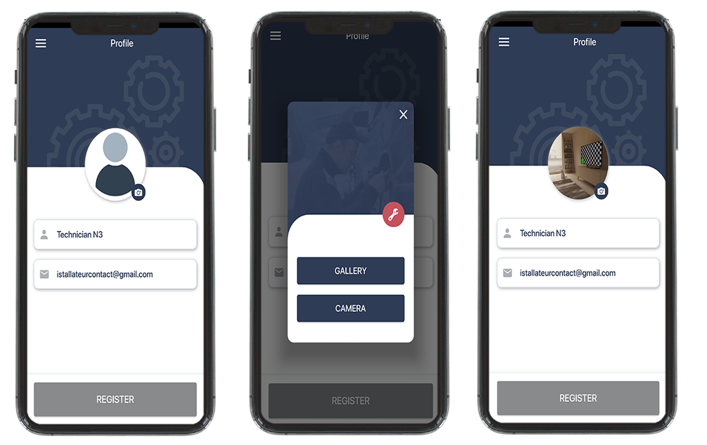
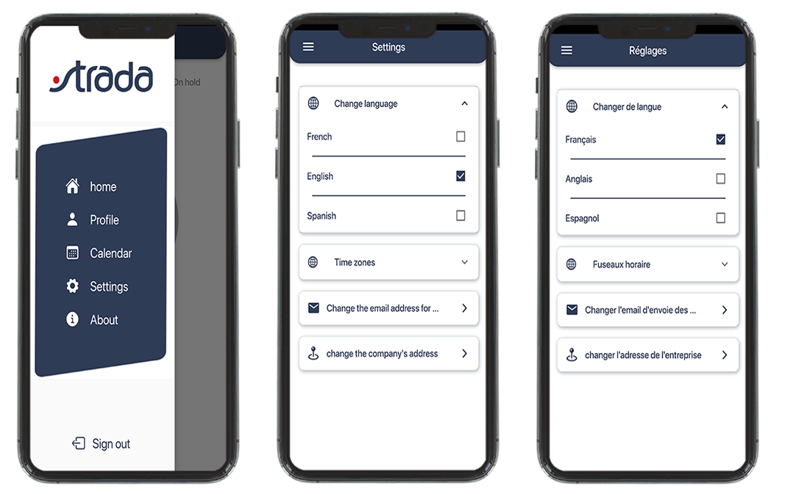
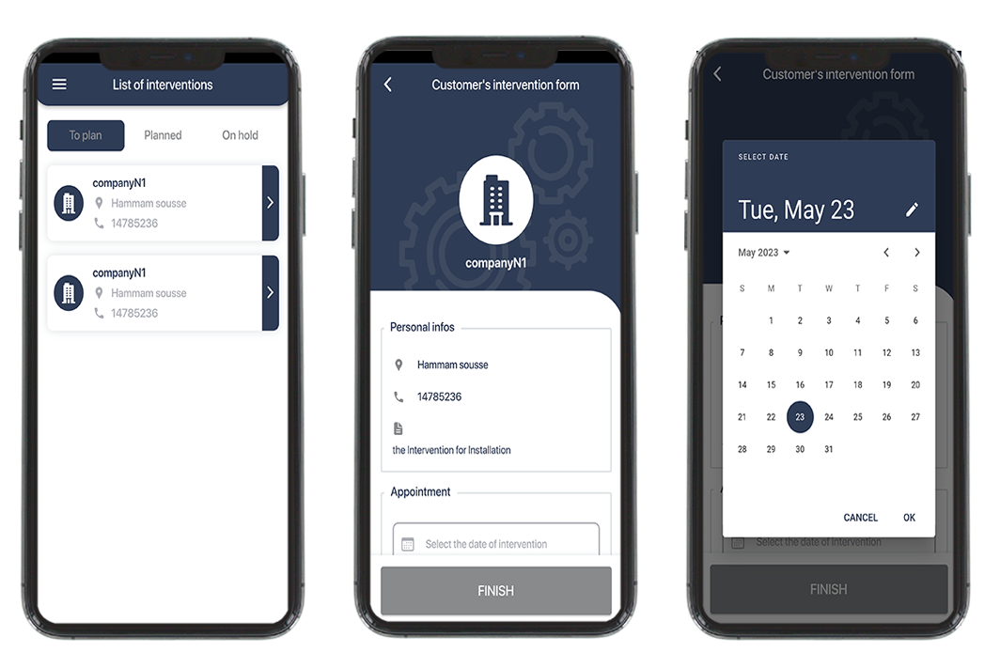
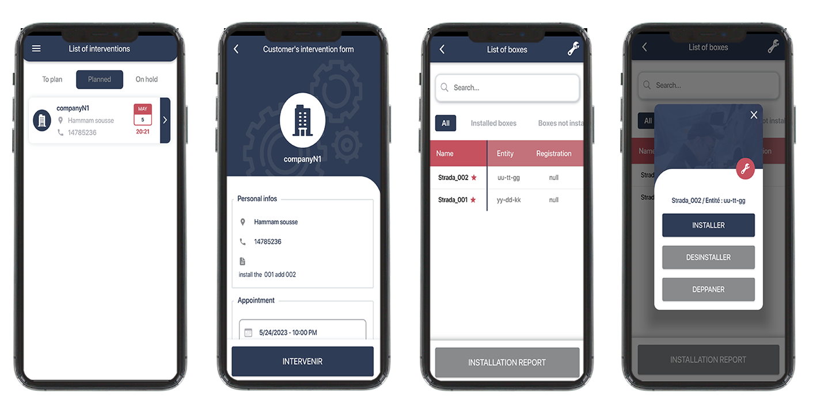
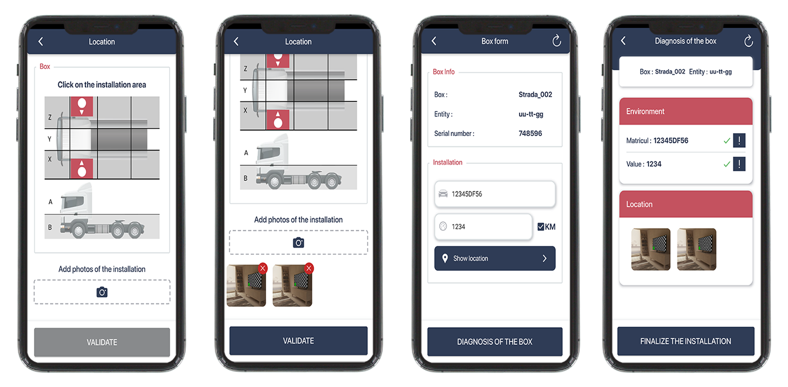
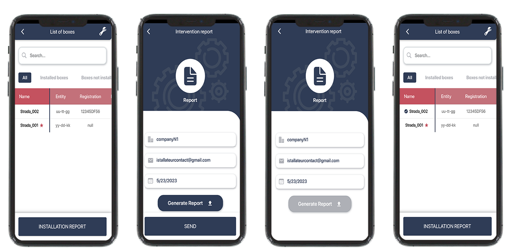

# Installateur Mobile App

Welcome to the Installateur mobile application repository!

## Overview

This project is a Flutter application designed to streamline the process of managing installation interventions for auto boxes. Installateur allows technicians in the field to efficiently handle their assigned tasks, update task statuses, capture and upload photos, and navigate to installation locations using GPS.


## Screenshots
The UI to connect to the application.

The Profile Management UI where the technician can access to his information and change
his image profile.

The Setting Management UI where the technician can change application language.  

The image below represents the different intervention planning screen interfaces where the technician
can plan the intervention.

The figure below represents the various screen interfaces where the technician can access and
manage the intervention box.

The figure below represents the different box installing screen interfaces where the technician can
plan upload images of the installation and save the vehicle information like (matricula, counter)

The figure below represents the report management UI where the technician can select
installed box to generate its report installation and send it to the company.


## Getting Started

### Prerequisites

Before getting started, ensure you have Flutter installed. If not, you can follow the [installation instructions](https://flutter.dev/docs/get-started/install) provided in the Flutter documentation.

### Installation

1. Clone the Installateur mobile application repository:
   ```sh
   git clone https://github.com/SidiahmedHABIB/installateur-mobile-app.git
   cd installateur-mobile-app
   ```

2. Install dependencies:
   ```sh
   flutter pub get
   ```

3. Run the app:
   ```sh
   flutter run
   ```

## Resources

- [Flutter Documentation](https://flutter.dev/docs)
- [Flutter Cookbook](https://flutter.dev/docs/cookbook)
- [Flutter API Reference](https://api.flutter.dev/)

## Contributing

We welcome contributions to improve the Installateur mobile application. Please see the contribution guidelines in the repository for more details.

## License

This project is licensed under the MIT License. See the [LICENSE](LICENSE) file for details.
## My Links
[](https://www.facebook.com/habib.sidiahmed.5)   [](https://www.linkedin.com/in/sidi-ahmed-habib-18163220a/)